### Haar 分類器、Labeling 與訓練

#### 機器學習 7 步驟

- 收集資料（Gathering data ）
- 準備數據（Preparing that data）
- 選擇模型（Choosing a model）
- 訓練機器（Training）
- 評估分析（Evaluation）
- 調整參數（Hyperparameter tuning）
- 預測推論（Prediction）

#### Haar 模型訓練

- Haar 分類器可以幫我們在影像中偵測某特定物件 ( object detection ) 是否存在，並可得知座標位置。這個特定物件可以是人臉、交通標誌、或者是貓或狗…等等，依據你的 Haar 特徵檔而異。
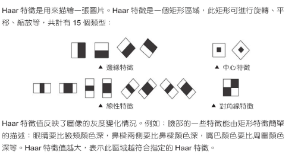

#### Haar 特徵分類器

- 安裝 Haar 模板 :
https://github.com/sauhaardac/haar-training

- 安裝 OpenCV 3.4.16：
https://opencv.org/releases/ 

- 調整 Haar 成我們可以使用的檔案
- 刪掉這些
  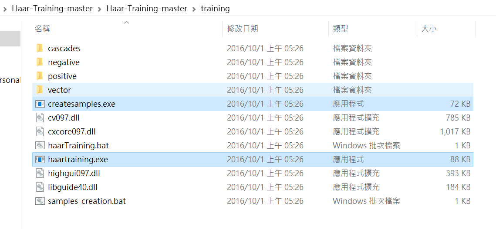

- 加入 OpenCV 資料夾中這些檔案
- 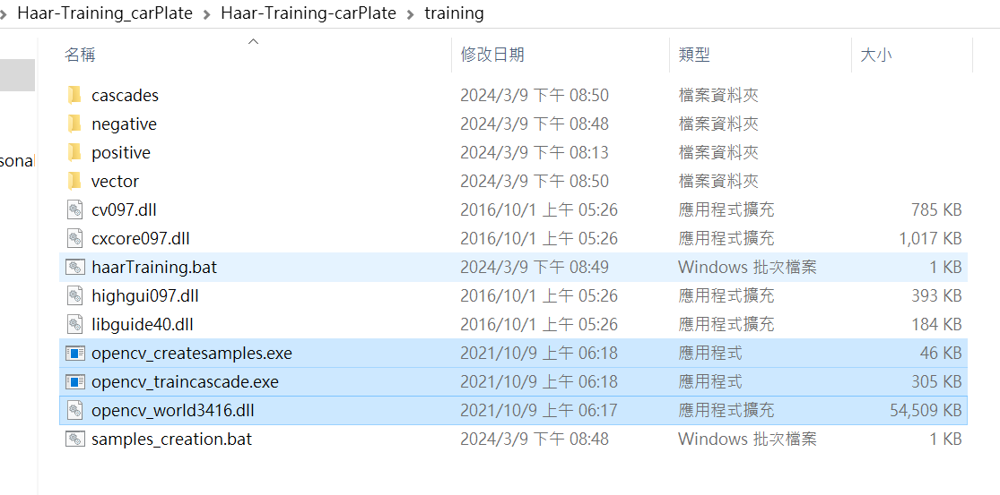

- 加入正樣本
  - 將 rawdata 中所有檔案刪除後加入正樣本照片
  - 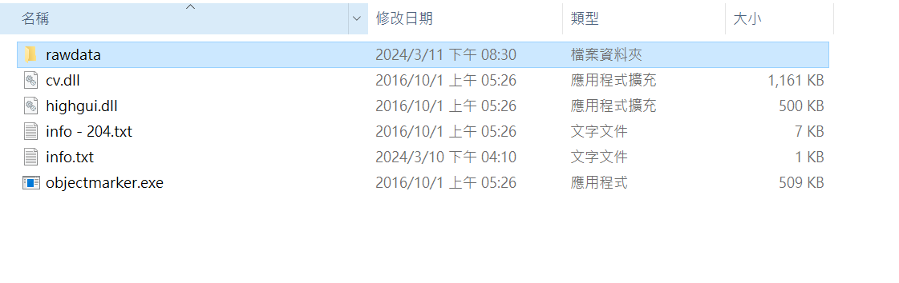
  - 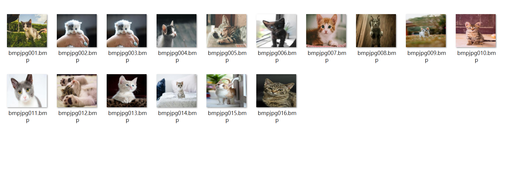
  
- 加入負樣本
  - 將 negative 中所有檔案刪除並加入負樣本照片
  - 將負樣本檔案列表並輸出成 .txt 檔，使得 Haar 可進行負樣本訓練
  - negBg.py
  - 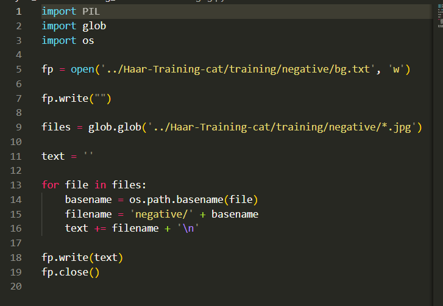

- 進行 Labeling
  - 將 positive 中的 objectmarker.exe 雙擊執行
  - 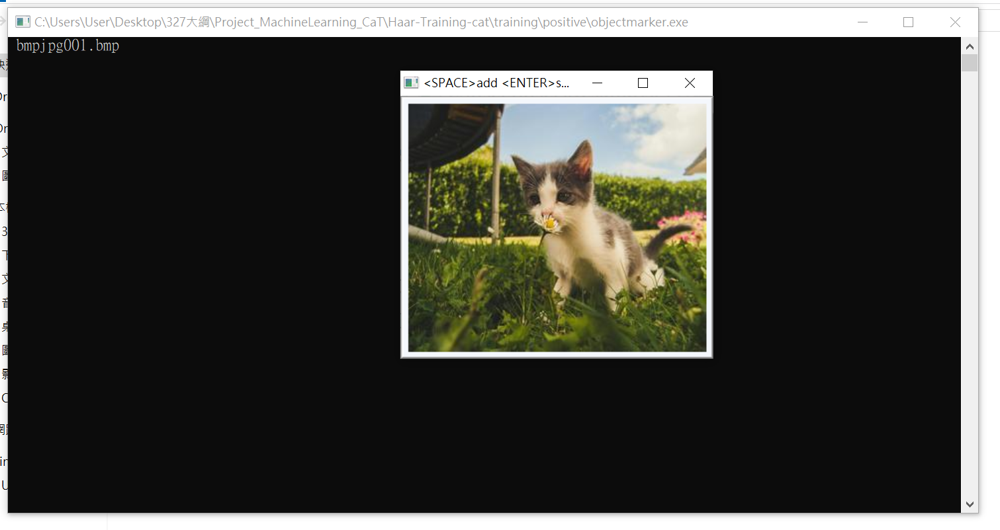
  - 選擇標記的區域
  - 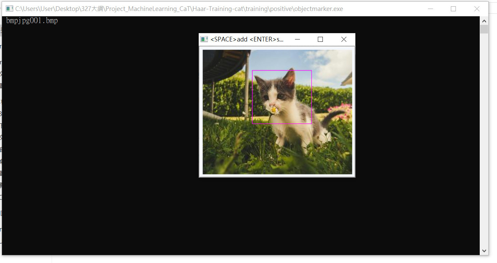
  - 如果標記的區域手滑標錯可以重新再標記
  - 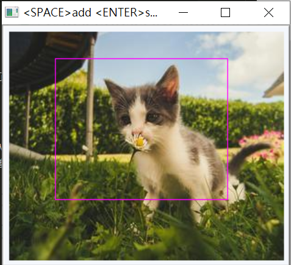
  - 確定標記區域後按 空白鍵
  - 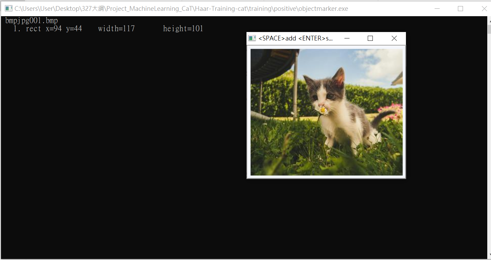
  - 按下 enter 鍵會跳到下一張圖片
  - 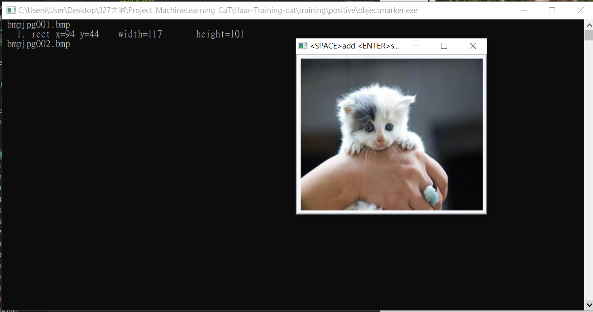
  - 重複執行直到標記完畢

#### 打包向量檔

- 將 cascade 中所有檔案刪除
- 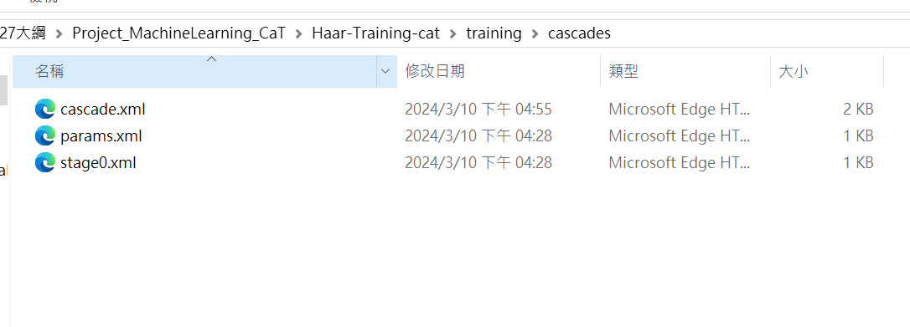
- 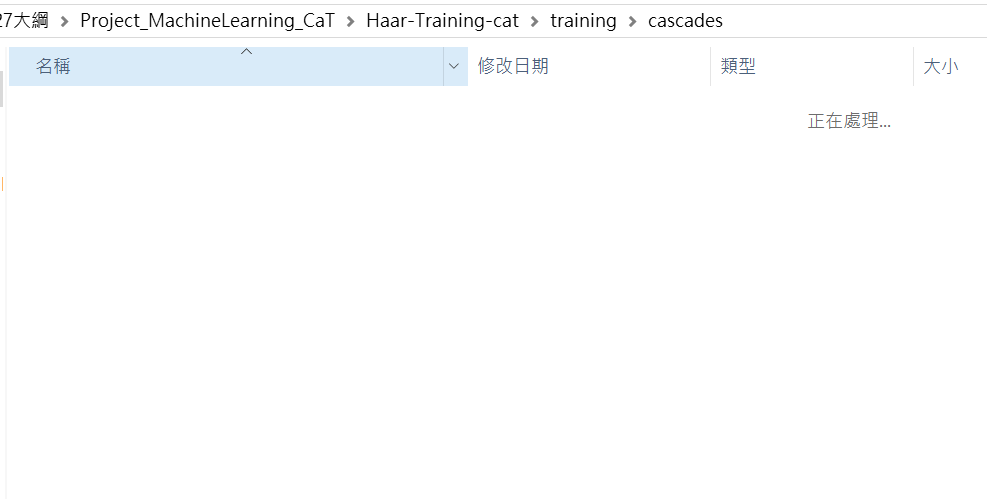

- 將 vector 中所有檔案刪除
- 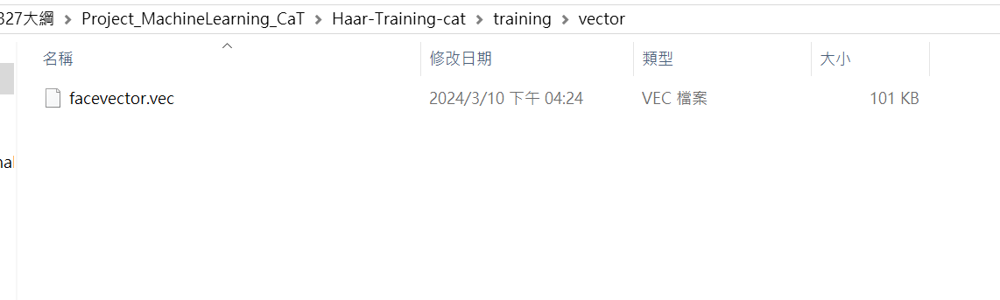
- 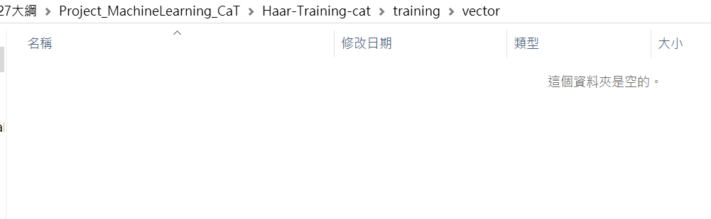
  
- 打開 positive 資料夾中的 info.txt 確定正樣本數量
- 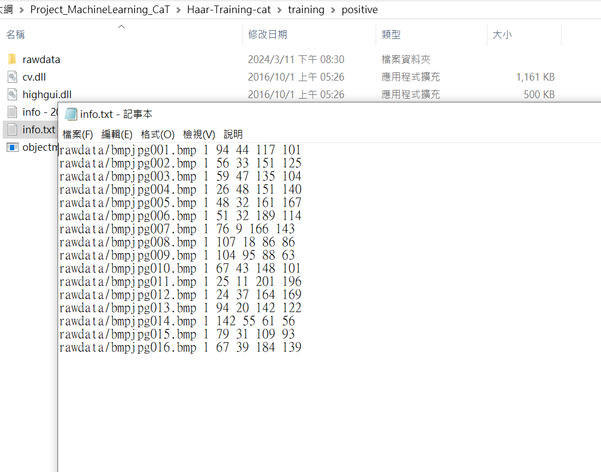

- 選取 sample_creation.bat 啟用編輯
- 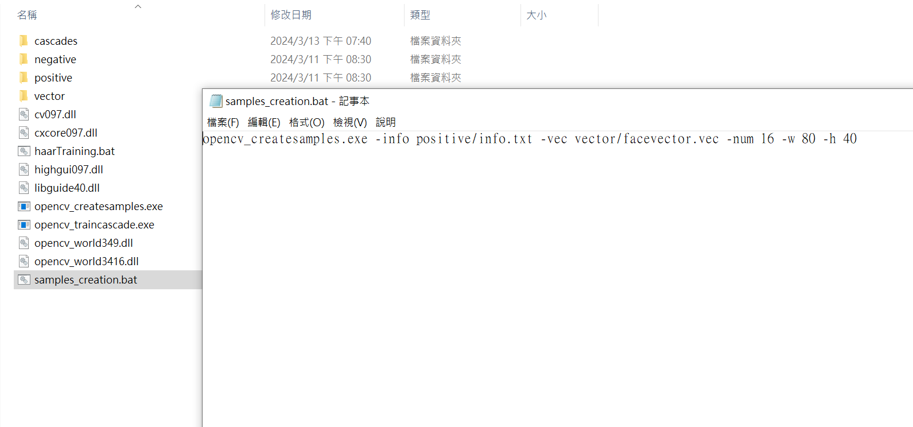
    - 更改內容
    - opencv_createsamples.exe -info positive/info.txt -vec vector/facevector.vec -num (正樣本數量) -w (資料寬度) -h (資料高度)
    - 單位是 px
    - 更改成以下參數
    - 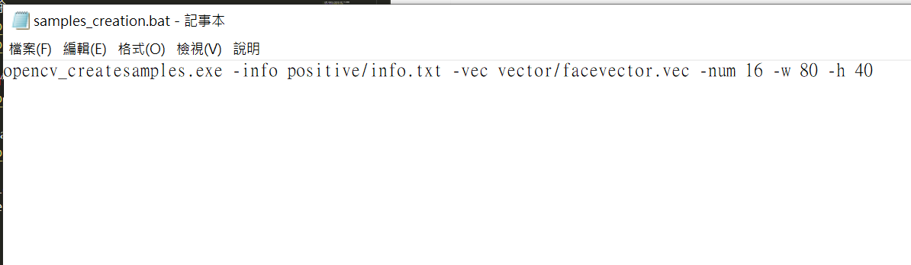
    - opencv_createsamples.exe -info positive/info.txt -vec vector/facevector.vec -num 16 -w 80 -h 40

- 選取 HaarTraining.bat 啟用編輯
- 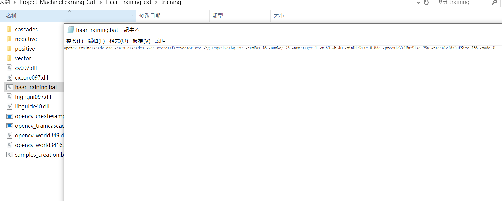
  - 更改內容
  - opencv_traincascade.exe -data cascades -vec vector/facevector.vec -bg negative/(負樣本列表.txt) -numPos (正樣本數量) -numNeg (負樣本數量) -numStages (訓練次數) -w (資料寬度) -h (資料高度) -minHitRate 0.888 -precalcValBufSize (訓練用記憶體數量) -precalcIdxBufSize (訓練用記憶體數量) -mode ALL
  - 更改成以下參數
  - 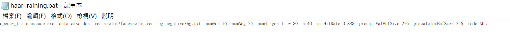
  - opencv_traincascade.exe -data cascades -vec vector/facevector.vec -bg negative/bg.txt -numPos 16 -numNeg 25 -numStages 1 -w 80 -h 40 -minHitRate 0.888 -precalcValBufSize 256 -precalcIdxBufSize 256 -mode ALL

- 雙擊 sample_creation.bat 執行打包向量檔
- 點選 vector 資料夾確認是否產生向量檔 (.vec)
- 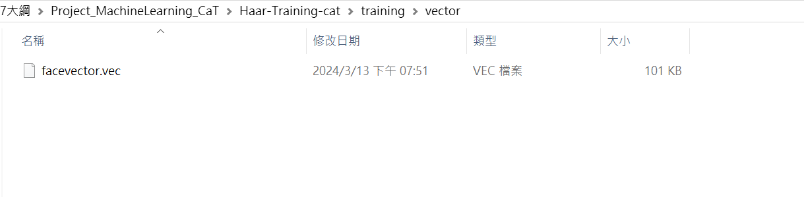

- 雙擊 HaarTraining.bat 執行訓練
- 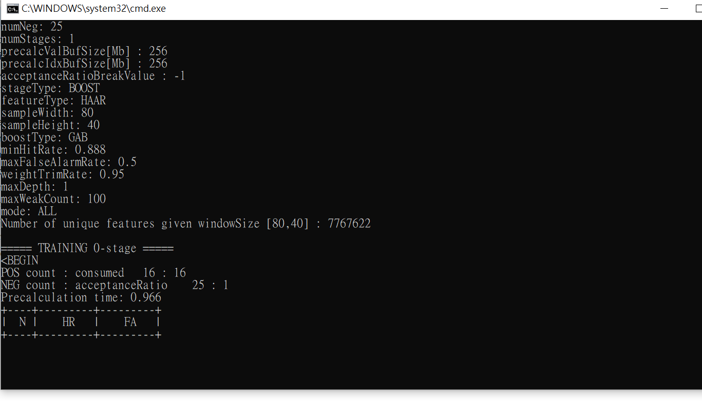
- 產生這個畫面代表已經開始訓練，訓練速度依電腦設備而有所不同
- 自動關閉後選取 cascade 資料夾確認是否產生 cascade.xml 檔案
- 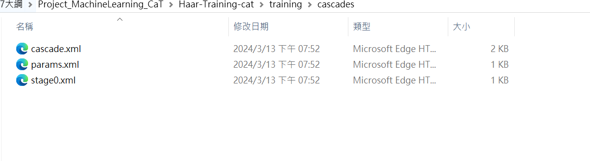
- 此檔案即為機器訓練的模型檔案