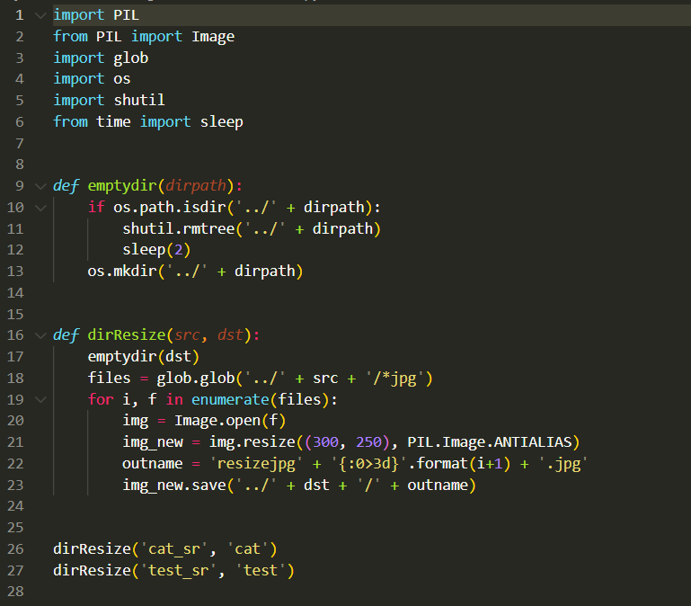
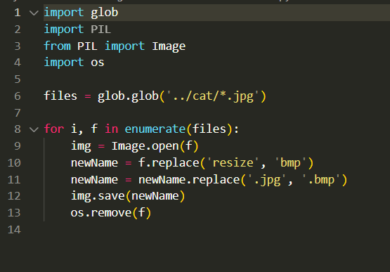
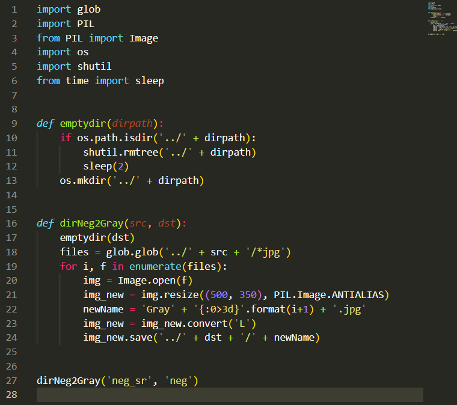

## 影像處理程式設計 Python

- ##### 1. 處理正樣本與測試資料
  - 圖片的檔案與尺寸大小可能不盡相同，故我們需要對照片進行 resize，方便機器進行學習

  - resize.py
  - 

  - 由於 Haar 分類器中正樣本的訓練檔案格式為 .bmp 檔，故我們需要先正樣本轉成 .bmp 檔
  - cat_JPG2NMP.py
  - 

- ##### 2. 處理負樣本
  - 在 Haar 分類器中，負樣本須為 "灰階" 圖片，且大小需比正樣本大
  - neg2Gray.py
  - 