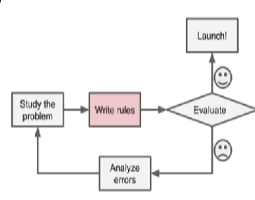
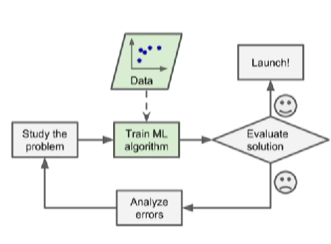
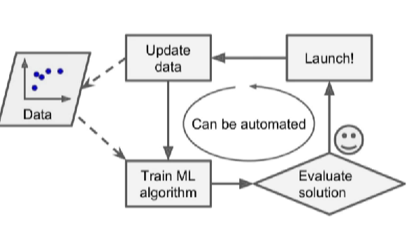

### 機器學習與人工智慧簡介

#### 名詞定義

- 1. 人工智慧：包含所有人類創造協助解決複雜問題的統稱
- 2. 機器學習：不需要人工干預，可以學會愗些特定的能力
  - 對於某類任務 T 和效能 P，如果一個計算機城市在 T 上以 P 衡量的效能隨著經驗 E 而自完善，那麼我們稱這個計算機城市再從機驗 E 學習
- 3. 深度學習：機器學習的子集，深入探討透過神經網路來解決複雜的問題

#### 機器學習

- 機器學習分成四種學習模式
- 1. 監督式學習：具有標籤的學習模式
  - 例：車牌辨識
- 2. 非監督式學習：無須標籤由機器自行分群的學習模式
  - 例：圖像生成
- 3. 半監督式學習：介於監督式學習與非監督式學習之間
  - 例：交通號誌分類
- 4. 強化式學習：由機器自行訓練並重複訓練
  - 例：自走車、AlphaGo

#### 深度學習

- 深度學習分成三類模型
- 1. 多層感知機
- 2. 深度神經網路 ( DNN )
- 3. 遞迴神經網路 ( RNN )
- 另有兩種常用之神經網路
- 1. 卷積神經網路 ( CNN )
- 2. 深度信念網路 ( DBN )
- 深度學習對資料依賴性高，可以從數據中學習高等特徵
- 原理牽涉到線性代數、微積分等，太複雜所以不講原理，知道就好

#### 傳統機器學習
- 

#### 機器學習方式
- 

#### 自動更新機制
- 